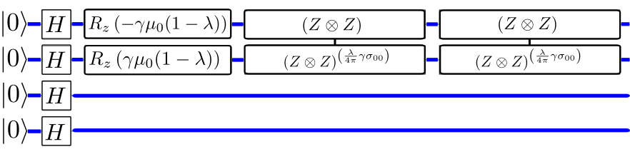

# A variational Quantum algorithm for portfolio optimization and rebalancing 

This project was carried out with support from [Zorc Finance](http://www.zorc-finance.com) by Oscar Javier Hernandez for research and development purposes as well as being part of the [Quantum open-source foundations mentorship program for 2020](https://qosf.org/).  Many thanks to my mentor Guoming Wang!

# Create a new virtual environment
`python3 -m venv /path/to/new/virtual/environment`

After installing the virtual environment locally, run the 
following command to install the environment requirements

`python -m pip install --upgrade pip`
`pip install -r requirements.txt`

# Activate environment
`$ source env/bin/activate`

In order to deactivate the environment

`$ deactivate`

# Add the virtual environment to the jupyter notebook Kernel
`pip install ipykernel`
`ipython kernel install --user --name=projectname`

# About
The [Quantum open source foundation (qosf)](https://qosf.org/) offers a [quantum mentorship program](https://qosf.org/qc_mentorship/) that allows newcomers to the field to work on an open source project with the support of an expert. I applied and was selected to participate in this program in 2020 with the support of my mentor Guoming Wang. The project allowed me to learn more about quantum computing and to implement an algorithm that had previously not been released as an open source code. This work was also carried out for research and developement purposes for [Zorc Finance.](https://www.zorc-finance.com)

# Project
The topic that was selected for this project was to implement the portfolio optimization problem as defined  [arXiv:1911.05296](https://arxiv.org/abs/1911.05296) who solve the portfolio rebalancing optimization problem using both soft and hard constraints. We use different optimization methods to determine the optimal angles for the quantum circuits. In particular, I implemented the cross-entropy method for optimizing the angles that has also been used in [arXiv:2003.05292](https://arxiv.org/abs/2003.05292) to determine the best penalty-scaling hyperparameters.

# Blog article

To learn more about the project, you can find more details here  

[Optimized portfolios with variational quantum algorithms](https://www.zorc-finance.com/post/optimal-portfolios-with-qaoa)

# Notebooks

The following notebooks are included in this repository

[Quantum portfolio optimization notebook](/Final_notebook.ipynb)
* Contains the main contributions of this project. Shows how to use the QAOA algorithm to optimize an N-stock portfolio.  

[Cross entropy optimization explanation notebook](/Cross_Entropy_Optimization.ipynb)
* Provides an explanation of the cross-entropy optimization method and applies it to a simple problem.

